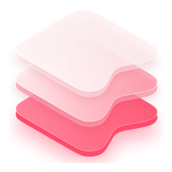
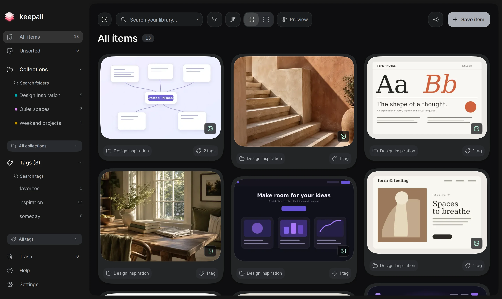

<p align="center">
  
</p>

<h1 align="center">Keepall</h1>

<p align="center">A personal library for your links, notes, images, and videos.</p>

<p align="center">
  <a href="https://www.keepall.app">Open Keepall</a> ·
  <a href="https://www.keepall.app/about">Explore the app</a> ·
  <a href="https://www.keepall.app/help">Help</a> ·
  <a href="https://chromewebstore.google.com/detail/keepall-capture/ehloefgfecmfjbncknaoleakbnjhkpea">Chrome extension</a>
</p>



Keepall gives the things you want to revisit a home beyond your open tabs. Save a useful page, collect images for a project, write a note, or keep a video from your device. Organize as much or as little as you need, then find it again with search.

Your library lives in your browser. No account required.

## What you can do

| Feature | What it does |
| --- | --- |
| Save | Keep links with previews, plain-text or Markdown notes, images, and local MP4 or WebM videos. Add notes to saved items for context. |
| Capture from Chrome | Save pages from the toolbar, or right-click links, images, and selected text. Open the capture drawer to add a note and choose collections or tags. |
| Organize | Group items into collections, connect them with tags, pin favorites, and leave new finds in Unsorted. |
| Find | Search titles, notes, captions, tags, and source URLs. Filter by item type and switch between grid and list views. |
| Browse images | View multi-image items as slides or a vertical gallery. Zoom in and pan around details. |
| Bring your library along | Import browser bookmark HTML files and image folders. Export a `.keepall.zip` backup and restore it in another browser or on another device. |
| Make it yours | Choose light or dark mode, install the web app, and revisit locally saved content offline after the app has been cached. |

Press **Alt+K**, or **Option+K** on Mac, to open the save panel. With Keepall Capture installed, the same shortcut opens its drawer on supported web pages.

## Your data

Keepall stores items, collections, tags, and media in IndexedDB through Dexie. Each browser profile and site origin has its own library. There is no automatic cloud sync.

Use **Settings → Backup** to download a copy of your library. Browser storage can be cleared or evicted, so keep a backup of anything you want to preserve. Changing domains or localhost ports also opens a separate library.

Once Keepall is cached, saved notes and local media can be available offline. Saving a link does not archive the original website. Fetching previews and opening source websites require a connection. The app also includes Vercel Web Analytics.

See the [storage and backup guide](https://www.keepall.app/help/storage-and-backups), [offline guide](https://www.keepall.app/help/offline), and [extension privacy page](https://www.keepall.app/extension-privacy) for details.

## Run locally

Use Node.js **22 or newer** and **pnpm 10.33.2**, the version pinned in `package.json`.

```bash
git clone https://github.com/MedLines/keepall.git
cd keepall
pnpm install
pnpm dev
```

Open [localhost:3000](http://localhost:3000), or the address printed by Next.js if that port is occupied. No account, API key, or external database is needed for local development.

The service worker is disabled in development. To try the production build, including offline behavior:

```bash
pnpm build
pnpm start
```

Open the app online first so it can cache the resources it needs.

### Test the Chrome extension locally

1. Start Keepall with `pnpm dev`.
2. Open `chrome://extensions` and enable **Developer mode**.
3. Choose **Load unpacked** and select this repository's `extension/` directory.
4. Open the extension's **Options**, set its library address to your local server, and choose **Check connection**.
5. Pin Keepall Capture, open a normal website, and save something.

The extension defaults to `https://www.keepall.app`. Use the exact same localhost address, port, and browser profile as your local library. Chrome's internal pages cannot be captured.

See the [extension README](extension/README.md) for capture behavior, permissions, and packaging instructions.

## Commands

| Command | Purpose |
| --- | --- |
| `pnpm dev` | Start Next.js with Turbopack |
| `pnpm build` | Build the production app and service worker with webpack |
| `pnpm start` | Serve the production build |
| `pnpm lint` | Run ESLint |
| `pnpm typecheck` | Check TypeScript without emitting files |
| `pnpm test` | Run Vitest tests |
| `pnpm test:watch` | Run Vitest in watch mode |
| `pnpm test:e2e` | Build the app and run Playwright in Chromium |
| `pnpm test:pwa-update` | Test the service-worker update flow, then rebuild |

Install Playwright's Chromium browser before the first browser test:

```bash
pnpm exec playwright install chromium
pnpm test:e2e
```

The standard browser tests serve the production app on port `3100`. The PWA update test uses port `3198` and manages its own builds.

## Deployment

Keepall needs a Next.js deployment with a Node.js runtime for link-preview routes. Use `pnpm build` as the build command and `pnpm start` when running your own Node server.

Set `NEXT_PUBLIC_KEEPALL_ORIGIN` before building to the exact public origin people will use, including `www` if applicable:

```dotenv
NEXT_PUBLIC_KEEPALL_ORIGIN=https://www.keepall.app
```

Use your own HTTPS origin when hosting elsewhere. The app uses this setting to decide where to register the service worker and request persistent browser storage. Non-local deployments without it, and preview URLs that differ from it, skip those features. Localhost is allowed for development and production testing.

[`.env.example`](.env.example) documents the setting. If you host the app at another domain and want extension capture, review the extension's host permissions and the app's extension-bridge allowlist as well.

## How it is built

The app uses **Next.js 16**, **React 19**, **TypeScript**, and **Tailwind CSS 4**. Dexie handles local persistence, Serwist handles the service worker, and Motion handles interface animation. Tests use Vitest, Testing Library, and Playwright.

```text
src/
  app/           App Router pages, UI, and API routes
  domain/        Types, validation, search, and import/backup rules
  persistence/   Dexie schema, queries, mutations, and stored assets
  server/        Link-preview fetching and image processing
  pwa/           Origin policy and install/offline support
extension/       Keepall Capture for Chrome
e2e/             Browser tests
public/          Icons, screenshots, and recorded demos
scripts/         Extension packaging and media tooling
```

Domain code stays independent of React and Dexie. UI uses the persistence layer rather than importing Dexie directly. IndexedDB is opened in the browser after mount or from event handlers, never during server rendering. The server fetches link-preview metadata and images; the library itself stays in browser storage.

## Contributing

For a bug, [open an issue](https://github.com/MedLines/keepall/issues) with your browser, steps to reproduce it, and what you expected. A screenshot helps with layout problems. Do not attach a personal library backup.

Keep pull requests focused, use pnpm, and run `pnpm lint`, `pnpm typecheck`, and `pnpm test`. Run the relevant Playwright tests for UI changes. Include a short explanation of the behavior change and how you checked it.

## License

Keepall is licensed under the [MIT License](LICENSE).

Third-party dependencies and assets retain their own licenses. The Inter font bundled with the Chrome extension is licensed under the [SIL Open Font License](extension/INTER-LICENSE.txt).
